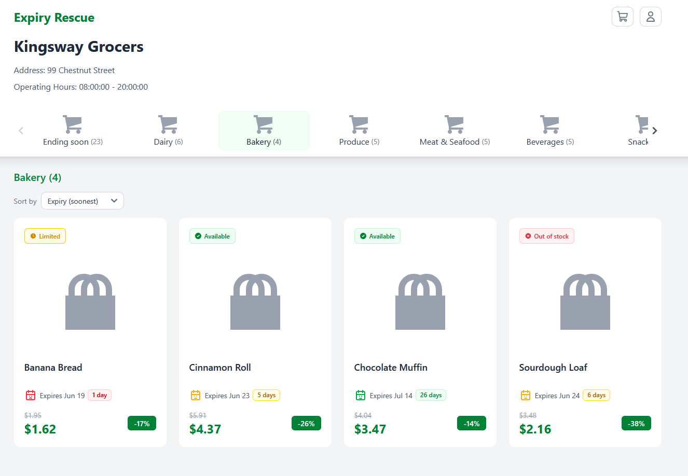
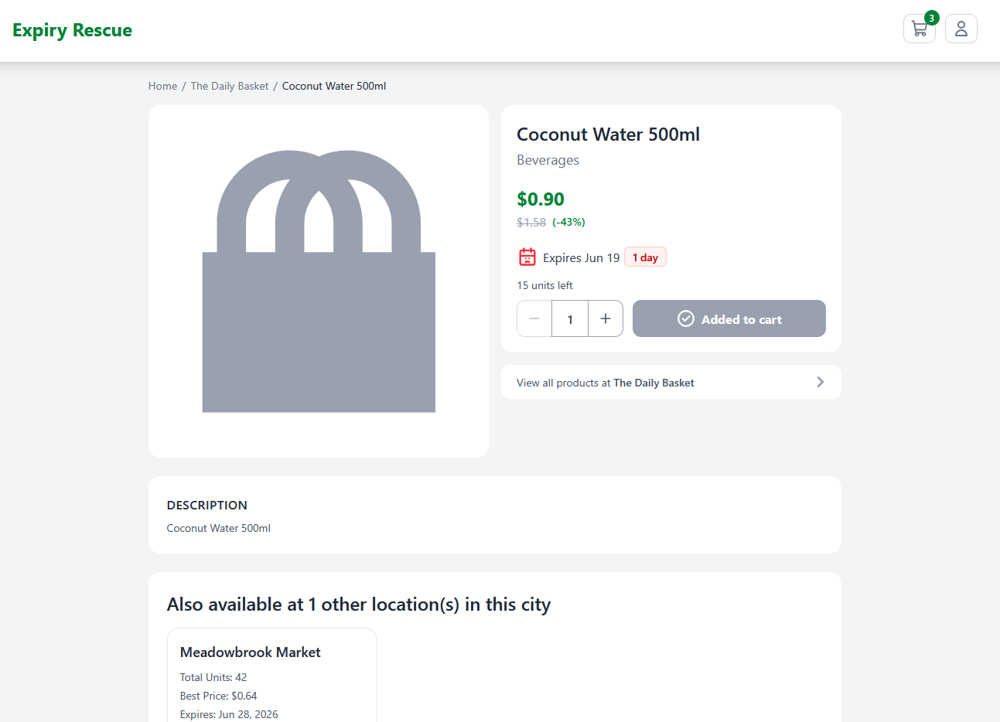
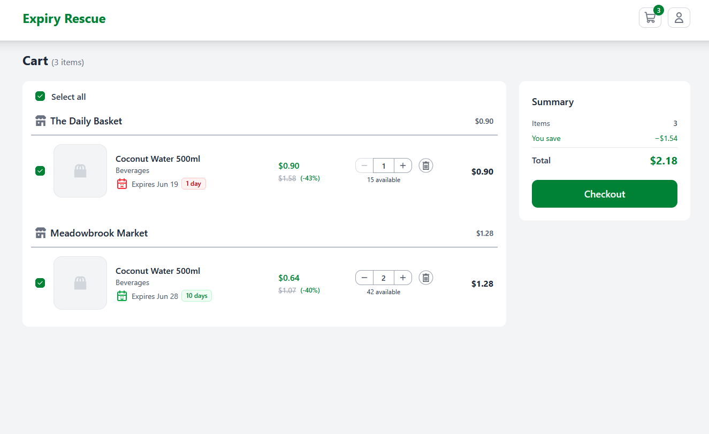
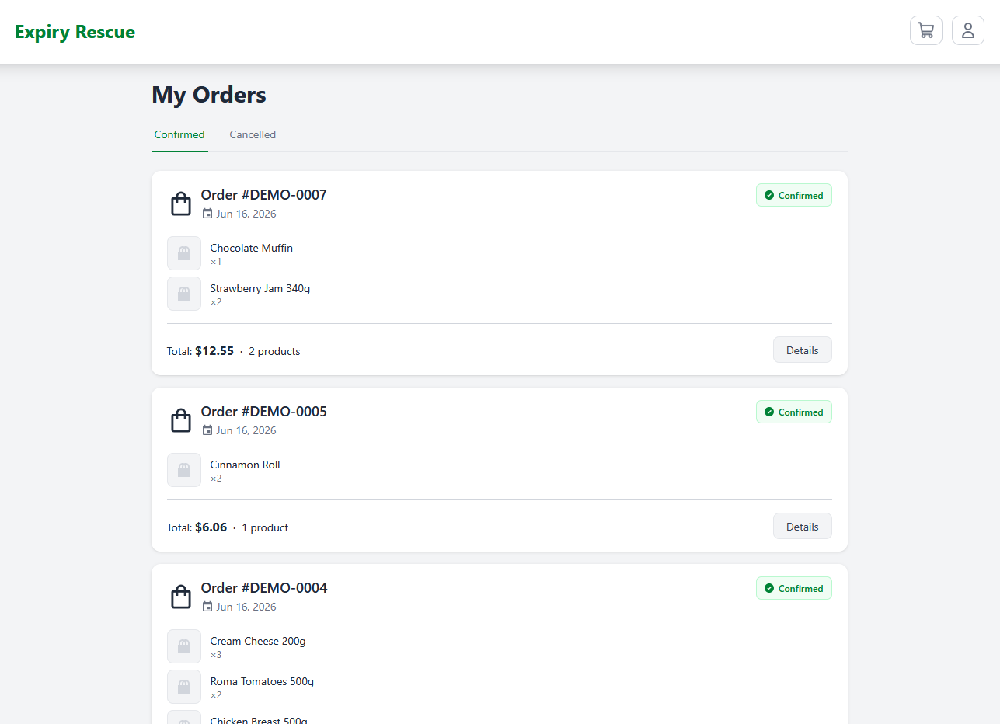

# Expiry Rescue

A full-stack web application that reduces food waste by connecting supermarkets with customers. Supermarkets list soon-to-expire products at discounted prices, and customers browse, order, and track them through an intuitive web interface.

**Live demo:** https://expiry-rescue-app.pages.dev
**Backend code:** [`web-server/`](web-server/) (Java 21 · Spring Boot 4) — **Frontend code:** [`web-app/`](web-app/) (Nuxt 4 · Vue 3)

---

## Try the demo

The demo is seeded with sample supermarkets, near-expiry products, and order history, so you can explore a realistic dataset immediately.

- Click **Demo login** on the sign-in page for instant one-click access — no account needed.
- Or sign in passwordless with email `demo@expiryrescue.app` and code `000000`.
- Or use **Sign in with Google** to create your own session.

---

## Screenshots

| Browse near-expiry products | Product detail |
| --- | --- |
|  |  |

| Multi-store cart | Order history |
| --- | --- |
|  |  |

---

## Tech Stack

| Layer                    | Technology                                                         |
| ------------------------ | ------------------------------------------------------------------ |
| Backend                  | Java 21, Spring Boot 4, Gradle                                     |
| Security                 | Spring Security, JWT (jjwt), Google OAuth2, passwordless email OTP |
| Persistence              | Spring Data JPA / Hibernate, PostgreSQL                            |
| Validation / Boilerplate | Bean Validation (Jakarta), Lombok                                  |
| Integrations             | Spring Mail (OTP delivery)                                         |
| Frontend                 | Nuxt 4, Vue 3, Pinia, Tailwind CSS, Axios                          |
| Hosting                  | Cloudflare Pages (frontend), Render (backend), Neon (PostgreSQL)   |

---

## Features

### For customers

- Browse discounted, near-expiry products from local supermarkets, filtered by city and category.
- Add products to a cart and place orders.
- View order history with status tracking (Pending / Confirmed / Cancelled).
- Multiple sign-in options: Google OAuth2, passwordless email OTP, and one-click demo login.

### Engineering highlights

- **Layered architecture** — Controller → Business → Service → Repository, with DTOs and mappers separating API contracts from persistence entities.
- **Optimistic locking** — prevents race conditions and overselling when inventory is updated concurrently.
- **Soft delete** — records are never physically removed; a `deleted_at` timestamp on a shared `BaseEntity` is applied throughout.
- **JWT authentication with refresh tokens** — stateless security backed by Spring Security filters, plus Google OAuth2 success/failure handlers.
- **Centralized exception handling** — custom exceptions (e.g. `ResourceNotFoundException`, `DuplicateResourceException`) mapped to consistent API error responses.
- **Portfolio demo mode** — an environment-gated profile that seeds rich sample data, exposes a one-click demo login, and runs a scheduled job to keep "expiring soon" dates current.

---

## Architecture

```
Request
  -> Controller        REST endpoints, request validation (/api/v1/...)
  -> Business           orchestration / use-case logic
  -> Service            domain operations
  -> Repository         Spring Data JPA
  -> PostgreSQL
```

Cross-cutting concerns: JWT/OAuth2 security filters, a shared `BaseEntity` (auditing + soft delete), DTO/mapper translation, and a global exception-to-response mapping.

---

## Running locally

### Prerequisites

- Java 21
- Node.js (with Yarn) for the frontend
- PostgreSQL running locally

### Backend (`web-server/`)

Set the required environment variables (a `.env` or your shell):

```
JWT_SECRET=<your-secret>
GOOGLE_CLIENT_ID=<google-oauth-client-id>
GOOGLE_CLIENT_SECRET=<google-oauth-client-secret>
# Optional: enable the seeded portfolio demo (one-click login + sample data)
DEMO_ENABLED=true
```

The default datasource points at `jdbc:postgresql://localhost:5432/expiry_rescue_db`. Then run:

```bash
cd web-server
./gradlew bootRun
```

The API starts on `http://localhost:8080`.

### Frontend (`web-app/`)

```bash
cd web-app
yarn install
yarn dev
```

The app starts on `http://localhost:3000`.

---

## API overview

| Resource                                  | Base path                    |
| ----------------------------------------- | ---------------------------- |
| Authentication (login / refresh / logout) | `/api/v1/auth`               |
| Passwordless + demo login                 | `/api/v1/auth/passwordless`  |
| Orders                                    | `/api/v1/orders`             |
| Product inventory                         | `/api/v1/products/inventory` |
| Product master                            | `/api/v1/products/masters`   |
| Product categories                        | `/api/v1/product-categories` |
| Supermarkets                              | `/api/v1/supermarkets`       |
| Cities / districts                        | `/api/v1/cities`             |

---

## Roadmap

- Admin / Staff dashboard for managing inventory, products, and supermarkets.
- Role-based access control (Admin / Staff).
- Idempotency filter to prevent duplicate orders from repeated requests.
- Customer feedback and rating system.
